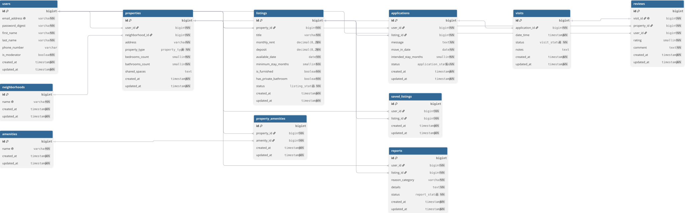

# Roomies

Roomies models shared housing: users, properties, room listings, applications, visits, reviews, saved listings, and reports. Built for the Web Technologies course.

## Team

- Thaiel Santiago
- Cristóbal Toro

## Requirements

- Ruby 4.0.6, as specified in `.ruby-version`, and Bundler
- Rails 8.1.4, installed through Bundler
- PostgreSQL 16 or later, running locally
- Node.js 26.10.0, as specified in `.node-version`, and Yarn

The frontend assets use Bootstrap 5.3 and Sass.

## Local setup

Clone the repository and install the dependencies:

```bash
git clone https://github.com/ThaielSC/webtech-roomies.git
cd webtech-roomies
bundle install
yarn install
```

Check that PostgreSQL is running:

```bash
pg_isready
```

By default, `config/database.yml` connects through a local socket using a PostgreSQL role with the same name as your operating system user. That role needs permission to create databases. If it does not exist, create it using a PostgreSQL administrator account:

```bash
createuser --createdb "$USER"
```

On Linux installations that use the `postgres` administrator account, run `sudo -u postgres createuser --createdb "$USER"` instead. If you use a different database user or a TCP connection, set `username`, `password`, and `host` in the development and test sections of `config/database.yml` to match your local installation.

Create the databases, run the migrations, and load the sample records:

```bash
bin/rails db:create
bin/rails db:migrate
bin/rails db:seed
```

Start the Rails server and the CSS watcher:

```bash
bin/dev
```

`bin/dev` installs Foreman if needed, then starts the processes in `Procfile.dev`. Open `http://localhost:3000/up` to check that Rails responds. You can inspect the records with `bin/rails console`.

## Sample data

The seed creates:

- 12 neighborhoods and 14 amenities
- 13 users: one moderator and 12 regular users
- 6 properties and 9 listings: 5 published, 1 draft, 1 reserved, 1 rented, and 1 withdrawn
- 8 applications, 6 visits, and 3 reviews
- 6 saved listings and 3 reports

Monthly rent and deposits are expressed in **UF**, stored as `decimal(8, 2)`. The sample rents range from 7.00 to 11.50 UF.

All sample users have the password `password123`. Example records include `moderador@roomies.cl` and `camila.soto@ejemplo.cl`.

Each review belongs to a completed visit. A visit can have at most one review, enforced by a model validation and a unique database index.

Running the seed again deletes the existing domain records and recreates the sample data. Use it in a local database whose records you can replace.

## Querying the models

Run these examples in `bin/rails console`:

```ruby
# Listings with published status
Listing.published

# Listings available on or after today
Listing.available_from(Date.current)

# Listings with monthly rent of at most 9.50 UF
Listing.under_rent(BigDecimal("9.50"))

# Applications by status
Application.pending
Application.shortlisted

# Reviews rated at least 4 out of 5
Review.positive
```

## Documentation

- [Design decisions](docs/design_decisions.md)
- [Model scenarios](docs/user_stories.md)
- [DBML specification](docs/domain_model.dbml)
- [Domain diagram](docs/diagram.svg)
- [Static landing prototype](landing/)


